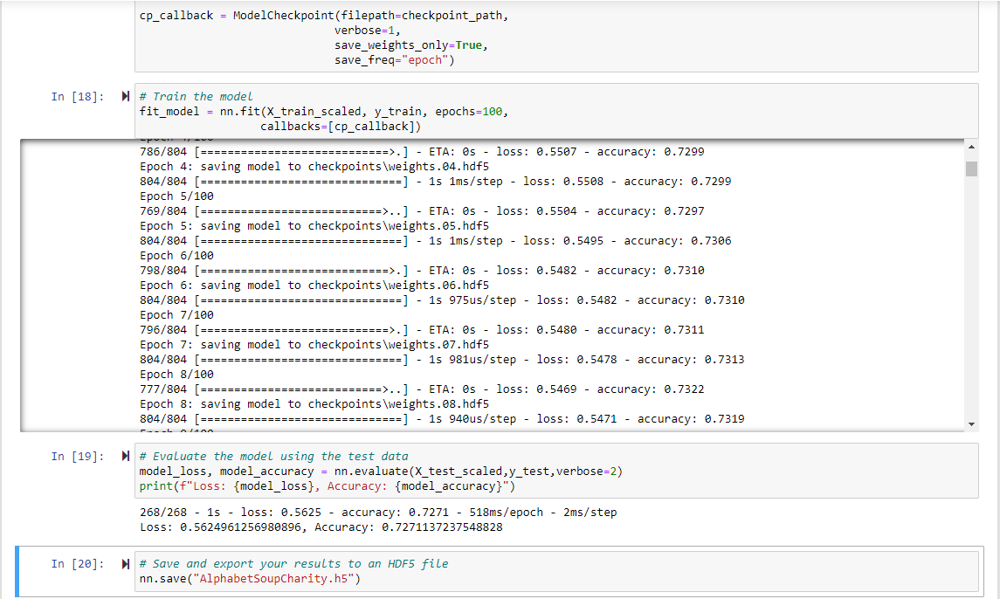
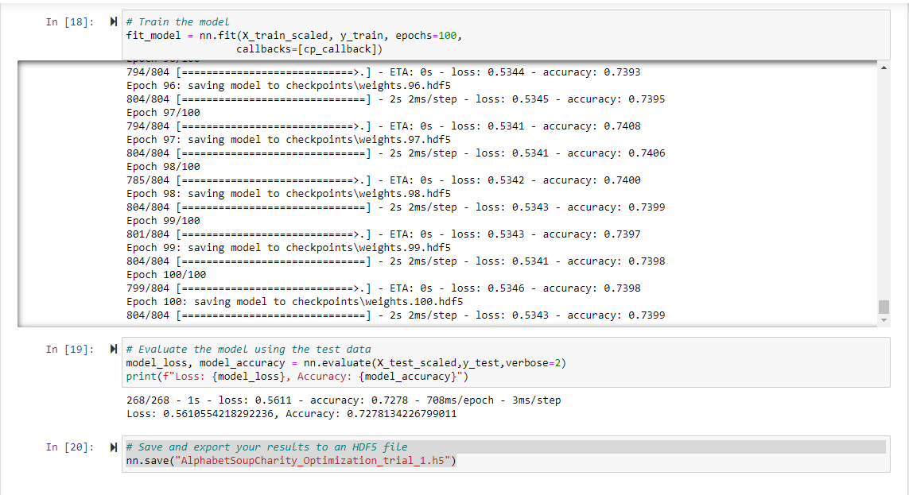
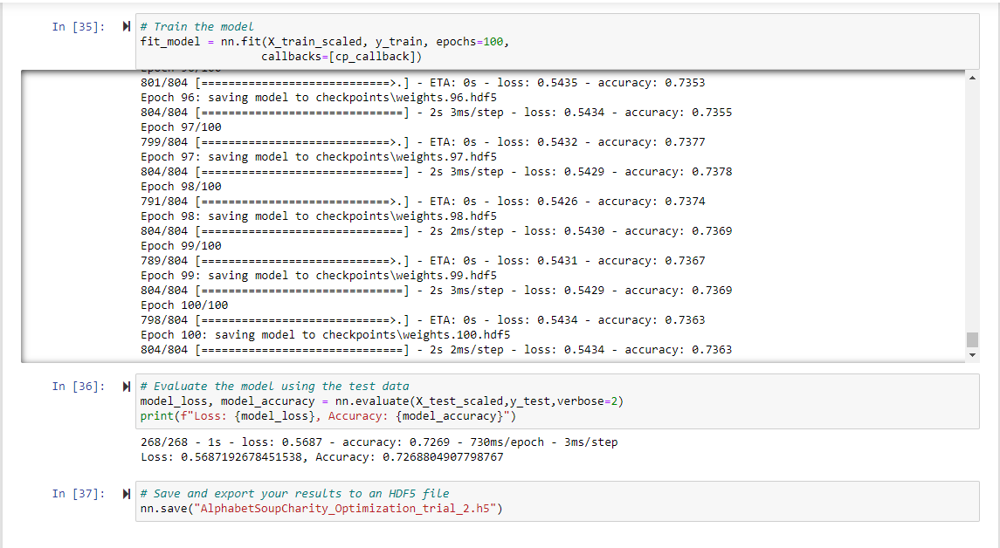
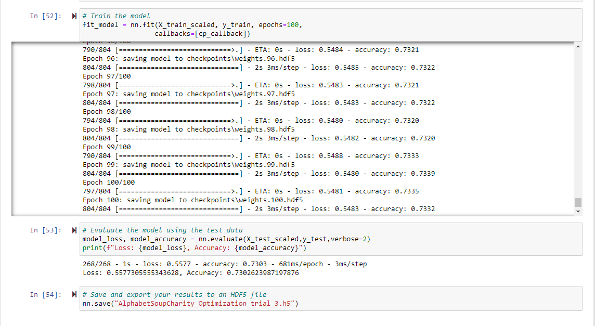
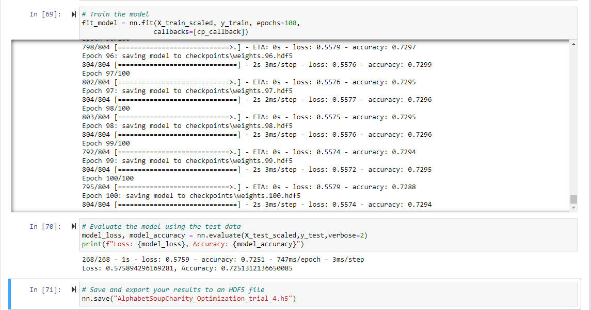

# Neural_Network_Charity_Analysis

## Overview of the Analysis

Alphabet Soup is a non-profit company that helps provide funding for applicants in need. 
The purpose of this analysis is to use the knowledge of machine learning and neural networks to create a binary classifier that is capable of predicting whether applicants will be successful if funded by Alphabet Soup.

## Results

1. Data Processing

    * What variable(s) are considered the target(s) for your model?
    
        The column "IS_SUCCESSFUL" is considered the target for the model.

    * What variable(s) are considered to be the features for your model?

        All columns other than "IS_SUCCESSFUL", "EIN" and "NAME" are considered as the features for the model.

    * What variable(s) are neither targets nor features, and should be removed from the input data?

        The columns "EIN" and "NAME" are only identifiers and should be removed from the input data.

2. Compiling, Training, and Evaluating the Model

    * How many neurons, layers, and activation functions did you select for your neural network model, and why?

        2 hidden layers are choosen for the model. Since there are 43 input variables, the number of neurons for the first layer is chosen as 80 (~ 2 times the number of input variables) and the number of neurons for the second layer is 30. The activation functions for the input layers are chooosen as "relu" and that of the output layer is chosen as "sigmoid". The accuracy achieved was only 72.71%.

        

    * Were you able to achieve the target model performance?

        No, even after 4 trials the highest accuracy achieved was only 73.03%.

    * What steps did you take to try and increase model performance?

        Trial 1 - Use 3 hidden layers with 80, 30 and 10 neurons. The accuracy achieved was only 72.78%.

        

        Trial 2 - Reduce the number of bins for APPLICATION_TYPE and CLASSIFICATION, use 3 hidden layers with 80, 30 and 10 neurons. The accuracy achieved was 72.69%.

        

        Trial 3 - Drop the "INCOME_AMT" column, increase the number of neurons to 100, 50 and 10 and change activation function to sigmoid. The accuracy achieved was 73.03%.

        

        Trial 4 - Drop the "ORGANIZATION" column, reduce the number of bins for APPLICATION_TYPE and CLASSIFICATION, increase the number of neurons to 100, 50 and 10. The accuracy achieved was 72.51%.

        

## Summary

Looking at all the trials for optimizing the model, it can be said that 3 hidden layers with 100, 50 and 10 neurons, "sigmoid" activation function and dropping the "INCOME_AMT" can achieve approximately 73% accuracy (Trial 3). This means that this model will be able to predict whether an applicant will be successful with 73% accuracy. 

"Easy Ensemble AdaBoost Classifier" model can be used in this case to see if the achieved accuracy is higher. The classifier is an ensemble of AdaBoost learners trained on different balanced bootstrap samples. The balancing is achieved by random under-sampling.